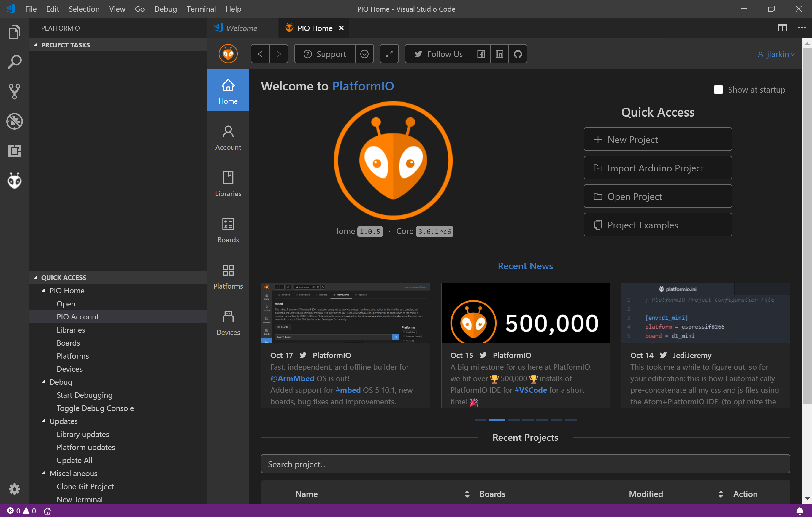
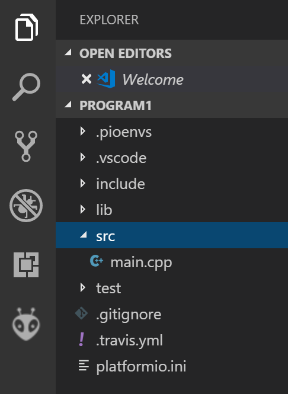

Programming Tools
=================

Microcontrollers running the Mbed OS can be programmed several different ways. The two that we have used are the online compiler (`os.mbed.com <https://os.mbed.com>`_) and the local combination of Visual Studio Code with the PlatformIO extension. There are some small differences between these two options that affect details of the code. Our library supporting the Flight Computer and its communication with the Command Module has been designed for the PlatformIO environment.

Getting started with Visual Studio Code and PlatformIO
------------------------------------------------------

If you wish to use VS Code and do not already have it installed, download it from `code.visualstudio.com <https://code.visualstudio.com/>`_.  Once you have VS Code running, you can install extensions.  You should select PlatformIO IDE as well as the C/C++ extension (from Microsoft).  If PlatformIO has been successfully installed, you will see its icon in the Activity Bar (`Fig. 1`_).

  Fig. 1. Activity bar in Visual Studio Code with PlatformIO icon highlighted.

Creating a new embedded project
-------------------------------

With no active workspace, click on the PlatformIO icon in the activity bar to open the PlatformIO side bar.  In the Quick Access section under the PIO Home heading, click on Open to see the PlatformIO home screen (`Fig. 2`_).

  Fig. 2. PlatformIO home screen.

Select New Project from the home screen.  Give your project a name (perhaps `Program 1` or `Blink Internal LED`).  In the Board selector, start by typing `lpc1768` and then select `NXP mbed LPC1768` as your board.  The framework should be automatically set to `mbed`.  You can use its default save location or choose your own.

The Explorer side bar should open after the project has been created.  Find the file `main.cpp` located in the `src` folder (`Fig. 3`_).  Click on it to see the template C++ file that was created.  You will be modifying this.

  Fig. 3. PlatformIO new project folders and files.

Compiling and loading the code
------------------------------

After you have made changes to the code, it is necessary to compile it.  This transforms it from relatively human-friendly C++ code into microcontroller-friendly machine language.  PlatformIO has intelligent default settings so all you need to do is click on a button.

The most important PlatformIO actions can be triggered by clicking on the appropriate button in the status bar at the bottom of the VS Code window.  The nine icons related to PlatformIO begin with the picture of a house (`Fig. 4`_).

.. figure:: img/platformio-ide-vscode-toolbar.png
  :name: Fig. 4
  :width: 415px

  Fig. 4. PlatformIO status bar icons.

Only four of these icons will be relevant to us.  The home icon (|home icon|) opens the PlatformIO home page where you can create a new project, import libraries, and search for information on systems supported by PlatformIO.  The check icon (|check icon|) compiles the active project. The right arrow icon (|-> icon|) uploads the compiled program to a connected microcontroller, automatically detecting its location.  The plug icon (|plug icon|) opens a serial monitor connetion between the computer and the microcontroller, allowing for two-way communication while the program is running.  Use of the serial monitor will be covered in later chapters.

Compile the code by clicking on |check icon|. A terminal window will open and you will see the progress of the compilation.  The Mbed API will need to be compiled for your particular microcontroller the first time you run so it may take a little while.  When it is done you should see a success message.  If not, correct your typing errors and try again.

After the code has been succesfully compiled, click on the |-> icon| to upload it to the microcontroller.  You need to have the mbed connected to your computer with a USB cable for this to work.  After you get the upload success message, press the reset button located in the center of the mbed to have it move this program into active memory and begin to run.

.. |nbsp| unicode:: 0xA0
   :trim:

.. |home icon| image:: https://api.iconify.design/octicon:home.svg?color=blue&height=16
.. |check icon| image:: https://api.iconify.design/octicon:check.svg?color=blue&height=16
.. |-> icon| image:: https://api.iconify.design/octicon:arrow-right.svg?color=blue&height=16
.. |plug icon| image:: https://api.iconify.design/octicon:plug.svg?color=blue&height=16

